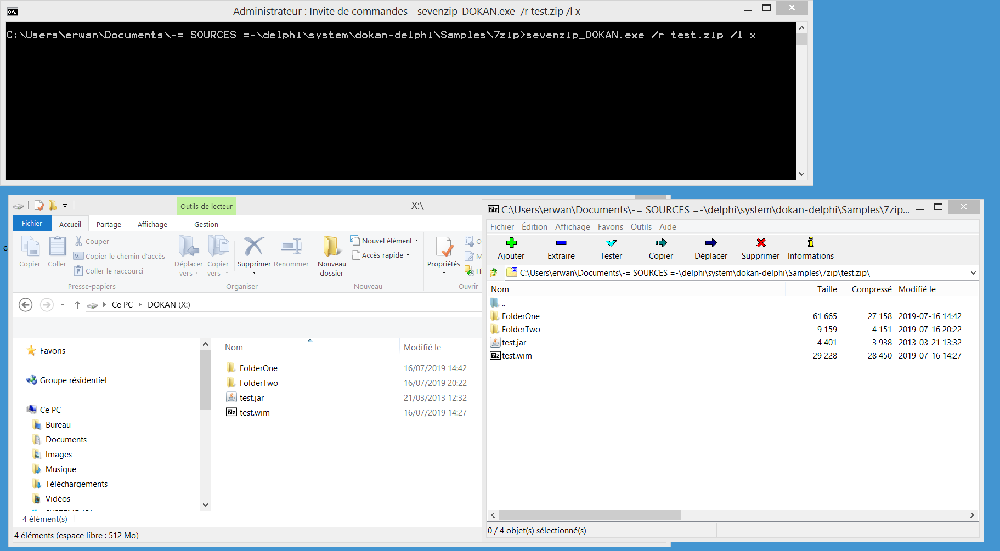

Mount a windows logical drive against an archive supported by 7zip using : 
Dokan (https://github.com/dokan-dev/dokany)  
7zip (https://www.7-zip.org/)  

Dokan is built against VC 2017 (you need the VC2017 runtime - see installation.txt). 
7z library is provided here. 

sevenzip_dokan run without arguments will give the possible options. 

Below a simple command line to mount a 7zip archive on X: 
sevenzip_DOKAN.exe /r test.zip /l x 
 
Below a simple command line to mount a 7zip archive on c:\mount\ 
sevenzip_DOKAN.exe /r test.zip /l c:\mount\ 
 
The below file system operations have been tested successfully : 
directory listing, directory browsing, read file, copy/paste file, execute a binary.

Only read operations are supported for now.

