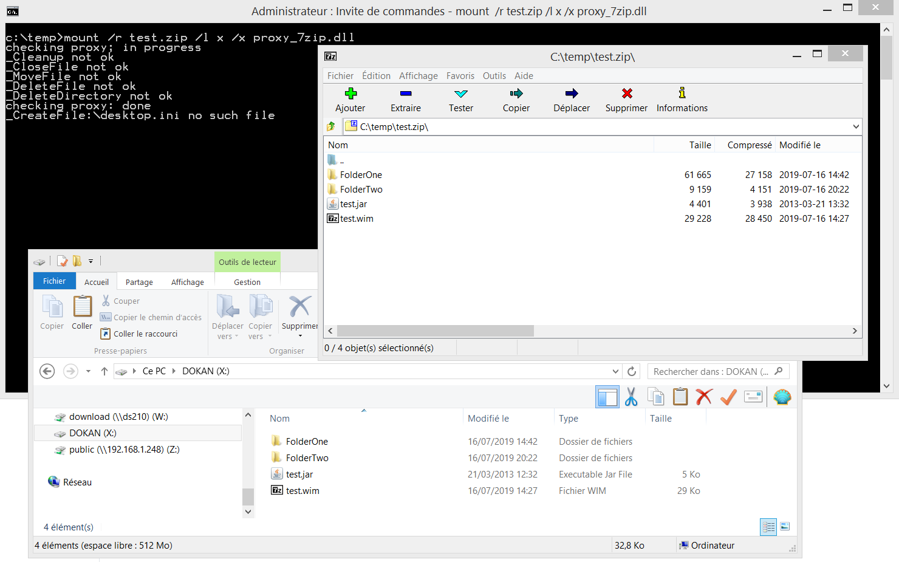

Create your own filesystem and mount it as either a logical drive or folder.
Dokan (https://github.com/dokan-dev/dokany)  

Dokan is built against VC 2017 (you need the VC2017 runtime - see installation.txt). 

Below a simple command line to mount a zip archive on X: 
mount.exe /r test.zip /l x /x proxy_7zip.dll  

Mount.exe is a generic code/binary independant of the filesystem you wish to create.  
The filesystem is implemented in a proxy/dll.  
Previous examples (https://github.com/erwan2212/dokan-delphi/tree/master/Samples/7zip and https://github.com/erwan2212/dokan-delphi/tree/master/Samples/7zip) are now obsolete and superseded by this new "generic dokan mount" example.

7zip proxy example is here : https://github.com/erwan2212/dokan-delphi/tree/master/Samples/Proxy_7zip .
NFS proxy example is here : https://github.com/erwan2212/dokan-delphi/tree/master/Samples/Proxy_NFS

