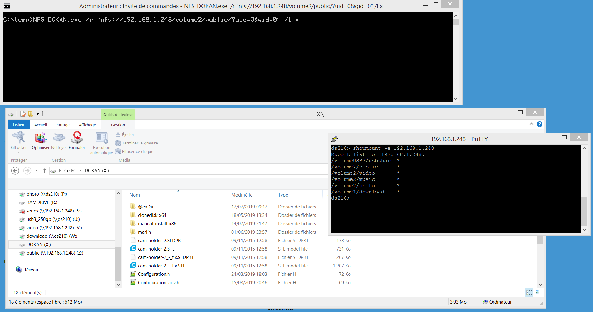

Mount a windows logical drive against a NFS export using : 
Dokan (https://github.com/dokan-dev/dokany)  
Libnfs (https://github.com/sahlberg/libnfs)  

Dokan is built against VC 2017 (you need the VC2017 runtime - see installation.txt). 
Libnfs is built against VC 2010 (you need the VC2010 runtime - both msvcr100.dll and libnfs.dll are provided here). 
Todo : have dokan and libnfs use the same VC runtime (preferably the generic msvcrt.dll). 

NFS_dokan run without arguments will give the possible options. 

Below a simple command line to mount a nfs export on X: 
NFS_DOKAN.exe /r "nfs://192.168.1.248/volume2/public/" /l x 

You can discover nfs exports on your lan with the below command: 
NFS_DOKAN.exe /discover 

The below file system operations have been tested successfully : 
directory listing, directory browsing, create directory, rename directory, create file, rename file, read file, write file, copy/paste file, delete file, delete directory.

